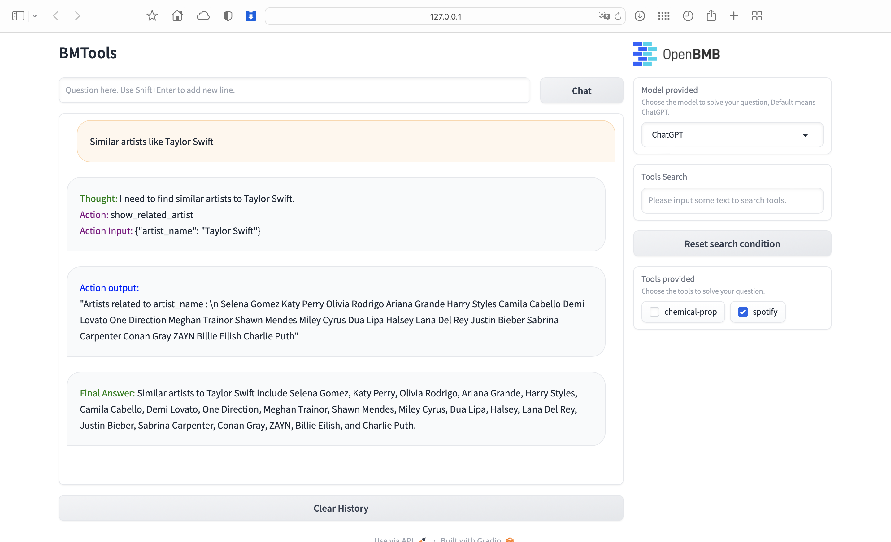

# BMTools with Spotify tool

This repository is forked from [BMTools](https://github.com/OpenBMB/BMTools)

## How to use

### Environment setup

first clone or download this repository

```bash
cd BMTools
pip install --upgrade pip
pip install -r requirements.txt
python setup.py develop
```

then create a virtual environment and switch to it

```bash
python -m venv myenv
source myenv/bin/activate
```

### Get API keys

To run this tools for Spotify, you need to have an [OpenAI](openai.com) account and a [spotify](spotify.com) account. 

Generate `OPENAI_API_KEY` in [here](https://platform.openai.com/api-keys), the performance of this tool sometimes highly depends on the rate limits of calling openAI, so the cheapest way is register a new open account to get the $5 free credits.

Get `SPOTIPY_CLIENT_SECRET`, `SPOTIPY_CLIENT_ID`  and `SPOTIPY_REDIRECT_URI`, please follow this document to create a spotify app, set the `SPOTIPY_REDIRECT_URI` to `http://localhost:8888/callback/`

### Run it

To run the tool, two process should be operated at the same time (i.e in two terminal tabs)

In the terminal for the server, export the environment variable and run host_local_tools.py:

```
export OPENAI_API_KEY= 'Your key'
export SPOTIPY_CLIENT_ID='Your client ID'
export SPOTIPY_CLIENT_SECRET='Your secret'
export SPOTIPY_REDIRECT_URI='http://localhost:8888/callback/'
./myenv/bin/python host_local_tools.py
```

In the terminal for the server, export the environment variable and run web_demo.py:

```
export OPENAI_API_KEY= 'Your key'
export SPOTIPY_CLIENT_ID='Your client ID'
export SPOTIPY_CLIENT_SECRET='Your secret'
export SPOTIPY_REDIRECT_URI='http://localhost:8888/callback/'
./myenv/bin/python web_demo.py
```

When web_demo.py is running, it should automatically open 127.0.0.1 in your defult browser . Check the `spotify` in `Tolls provided` and input questions in the textfield.

### Other tools

For other tools used in  [BMTools](https://github.com/OpenBMB/BMTools):

1. follow their readme to find where to get the API keys for corresponding tools

2. uncomment corresponding lines in both `host_local_tools.py` and `web_demo.py`

3. follow the same process of exporting api environment variables

    
